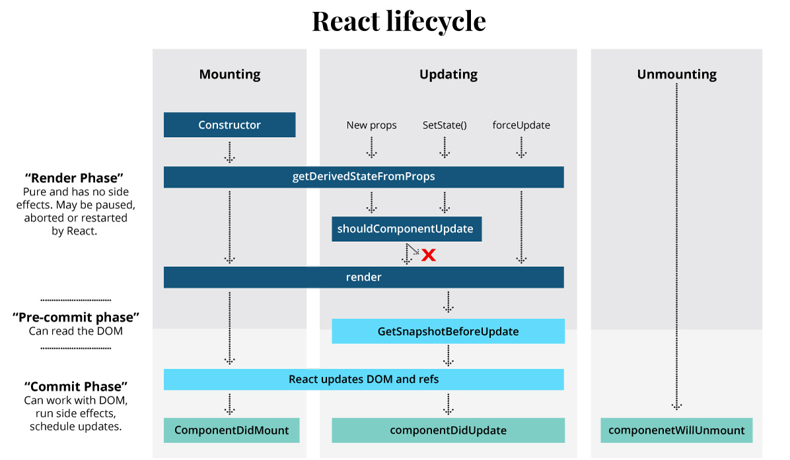

# OTUS

## Javascript Basic

<!--v-->

### Вопросы?

<!--s-->

## Hooks в React: useState, useEffect, useCallback, useMemo

<!-- v -->

[Хуки (Hooks)](https://react.dev/reference/react/hooks) — это функции, которые позволяют "подцепиться" к состоянию и возможностям жизненного цикла React из функциональных компонентов.

Появились в React 16.8 (2019 год).

В React можно описывать компоненты двумя способами: **функциональным** и **классовым**

<!-- v -->

Жизненный цикл компонента в React

```
1. МОНТИРОВАНИЕ - Mounting
   ├── Конструктор / useState
   ├── Рендер (первый)
   └── useEffect с пустым массивом зависимостей

2. ОБНОВЛЕНИЕ - Updating (может повторяться много раз)
   ├── Рендер (из-за изменения пропсов/состояния)
   └── useEffect (в зависимости от deps)

3. РАЗМОНТИРОВАНИЕ - Unmounting
   └── Функция очистки useEffect
```

<!-- v -->



<!-- v -->

## Вопросы?

<!-- s -->

## useState

<!-- v -->

[useState](https://ru.react.dev/reference/react/useState) - это хук React, который позволяет добавить переменную состояния в компонент.

<!-- v -->

```js
const [state, setState] = useState(initialState);
```

**useState** возвращает массив, содержащий ровно **два значения**:

- **Текущее состояние** (state). Во время первого рендера оно будет соответствовать переданному вами **initialState**.

- **Функция set** (setState), которая позволяет обновить состояние до другого значения и вызвать повторный рендеринг.

<!-- v -->

<small>

Разница между setAge(age => age + 1) и setAge(age + 1)

1. React НЕ обновляет состояние сразу
2. Обновления ставятся в очередь
3. Батчинг (batch) - несколько setState (обновлений состояния) за один рендер

</small>

```jsx
// ❌ ПЛОХО - не работает
function Counter() {
  const [count, setCount] = useState(0);

  const increment = () => {
    setCount(count + 1); // setCount(0 + 1) → setCount(1)
    setCount(count + 1); // setCount(0 + 1) → setCount(1)
    // Результат: count увеличится только на 1, а не на 2!
  };

  return <button onClick={increment}>+2</button>;
}

// ✅ ХОРОШО - работает правильно
function Counter() {
  const [count, setCount] = useState(0);

  const increment = () => {
    setCount((prev) => prev + 1); // prev = 0 → 1
    setCount((prev) => prev + 1); // prev = 1 → 2
    // Результат: count = 2
  };

  return <button onClick={increment}>+2</button>;
}
```

<!-- v -->

```javascript
import { useState } from "react";

export default function UseStatePage() {
  const [count, setCount] = useState(0);

  const incrementCount = () => setCount((count) => count + 1);

  // Функциональное обновление
  const decrementCount = () => setCount((prev) => prev - 1);

  return (
    <>
      <h1>Hook useState</h1>

      <h3>{count}</h3>

      <button onClick={incrementCount}> + 1 </button>

      <button onClick={decrementCount}> - 1 </button>
    </>
  );
}
```

<!-- v -->

## Вопросы?

<!-- v -->

```javascript
import { useState } from "react";

export default function MyInput() {
  const [text, setText] = useState("hello");

  function handleChange(e) {
    setText(e.target.value);
  }

  return (
    <>
      <input value={text} onChange={handleChange} />
      <p>You typed: {text}</p>
      <button onClick={() => setText("hello")}>Reset</button>
    </>
  );
}
```

<!-- v -->

## Вопросы?

<!-- v -->

```javascript
import { useState } from "react";

export default function MyCheckbox() {
  const [liked, setLiked] = useState(true);

  function handleChange(e) {
    setLiked(e.target.checked);
  }

  return (
    <>
      <label>
        <input type="checkbox" checked={liked} onChange={handleChange} />I liked
        this
      </label>
      <p>You {liked ? "liked" : "did not like"} this.</p>
    </>
  );
}
```

<!-- v -->

```javascript
import { useState } from "react";

export default function Form() {
  const [name, setName] = useState("Taylor");
  const [age, setAge] = useState(42);

  return (
    <>
      <input value={name} onChange={(e) => setName(e.target.value)} />
      <button onClick={() => setAge(age + 1)}>Increment age</button>
      <p>
        Hello, {name}. You are {age}.
      </p>
    </>
  );
}
```

<!-- v -->

## Вопросы?

<!-- s -->

## useEffect

<!-- v -->

- [useEffect](https://ru.react.dev/reference/react/useEffect) позволяет управлять различными сопутствующими действиями в функциональном компоненте или то, что называется **_"side effects" (побочные эффекты)_**,  
  например, извлечение данных, ручное изменение структуры DOM, использование таймеров, логгирование и т.д.

<!-- v -->

```jsx
useEffect(setup, dependencies?)
```

- **setup**: Функция с логикой эффекта.

- опциональные **dependencies**: массив зависимостей, который говорит хуку, когда нужно сработать.

<!-- v -->

Есть 3 варианта передачи зависимостей в данных хук:

1. Не передать ничего
2. Передать пустой массив - []
3. Передать массив с переменными для отслеживания - [value]

<!-- v -->

1. Не передать ничего

```jsx
import { useEffect, useState } from "react";

export default function UseEffectPage() {
  const [value, setValue] = useState({});

  useEffect(() => {
    // Эффект срабатывает при монтировании компонента и при каждом рендере.
    console.log("Срабатываю на каждый рендер");
  });

  return (
    <div>
      <button onClick={() => setValue({})}>Обновить состояние</button>
    </div>
  );
}
```

<!-- v -->

## Вопросы?

<!-- v -->

2. Передать пустой массив - []

```jsx
import { useEffect, useState } from "react";

export default function UseEffectPage() {
  const [count, setCount] = useState(0);

  useEffect(() => {
    // Эффект срабатывает только при монтировании компонента.
    console.log("Сработаю 1 раз");
  }, []);

  return (
    <div>
      <h3>{count}</h3>
      <button onClick={() => setCount((prev) => prev + 1)}> + 1</button>
    </div>
  );
}
```

<!-- v -->

## Вопросы?

<!-- v -->

3. Передать массив с переменными для отслеживания

```jsx
export default function UseEffectPage({ userId = 2 }) {
  const [user, setUser] = useState(null);
  const [isLoading, setIsLoading] = useState(false);

  useEffect(() => {
    if (!userId) return;
    setIsLoading(true);

    fetch(`https://jsonplaceholder.typicode.com/users/${userId}`)
      .then((response) => response.json())
      .then((json) => setUser(json))
      .catch((error) => console.error("Ошибка загрузки:", error))
      .finally(() => setIsLoading(false));
  }, [userId]); // Запускается заново, если изменился userId

  if (isLoading) return <div>Загрузка...</div>;
  if (!user) return <div>Выберите пользователя</div>;

  return (
    <div>
      <h1>useEffect</h1>
      <h3>{user.name}</h3>
      <p>{user.email}</p>
    </div>
  );
}
```

<!-- v -->

Как правильно использовать асинхронные функции в React useEffect

```jsx
// !!! Не делайте так!
useEffect(async () => {
  const data = await fetchData();
}, []);
```

- Проблема: useEffect ожидает функцию, которая возвращает либо undefined, либо функцию очистки, а async функция возвращает Promise.

<!-- v -->

Правильный способ

```jsx
useEffect(() => {
  const fetchData = async () => {
    const data = await fetch("https://api.com");
    const json = await data.json();
    setData(json); // Обновляем состояние ВНУТРИ асинхронной функции
  };

  fetchData().catch(console.error);
}, []);
```

```jsx
// функция вынесена наружу
const fetchData = useCallback(async () => {
  const data = await fetch("https://api.com");
  setData(data);
}, []);

useEffect(() => {
  fetchData().catch(console.error);
}, [fetchData]);
```

<!-- v -->

Ключевые моменты:

1. Не делайте useEffect async - это нарушает его контракт
2. Создавайте асинхронные функции внутри useEffect
3. Обрабатывайте ошибки с помощью .catch()
4. Используйте useCallback если выносите функцию наружу

<!-- v -->

## Вопросы?

<!-- v -->

У useEffect есть важная возможность -  
возвращать функцию очистки

```jsx
// Монтирование, размонтирование и обновление
useEffect(() => {
  // Код выполняется ПРИ монтировании компонента (componentDidMount)
  // и ПРИ обновлении зависимостей из массива (componentDidUpdate)

  return () => {
    // Функция очистки выполняется:
    // - ПЕРЕД повторным выполнением эффекта (при изменении зависимостей)
    // - ПРИ РАЗмонтировании компонента (componentWillUnmount)
  };
}, [dep1, dep2, dep3]); // Массив зависимостей
```

<!-- v -->

Пример очистки функции с интервалом

```jsx
export default function Timer() {
  const [time, setTime] = useState(new Date().toLocaleTimeString());

  useEffect(() => {
    console.log("✅ Таймер запущен");

    // Запускаем интервал при монтировании
    const intervalId = setInterval(() => {
      const currentTime = new Date().toLocaleTimeString();
      setTime(currentTime);
      console.log("🕒 Время обновлено:", currentTime);
    }, 1000);

    // Функция очистки
    return () => {
      console.log("Таймер остановлен");
      clearInterval(intervalId);
    };
  }, []); // Пустой массив - эффект только при монтировании/размонтировании

  return (
    <div>
      <h3>Текущее время: {time}</h3>
    </div>
  );
}
```

<!-- v -->

## Вопросы?

<!-- s -->

## useMemo

<!-- v -->

[useMemo](https://ru.react.dev/reference/react/useMemo) - мемоизация значений, кеширует результаты вычислений между ререндерами.  
Служит для **_оптимизации_**!

- **_Проблема:_** Сложные вычисления внутри компонента выполняются при каждом рендере, даже если их входные данные не изменились.

- Вычисление повторяется только при изменении зависимостей.

<!-- v -->

```jsx
const memoizedValue = useMemo(calculateValue, dependencyArray);
```

- **_calculateValue_**: Функция, вычисляющая значение, которое хотите кэшировать.  
  Она должна быть чистой, не принимать аргументов и возвращать значение любого типа.

- **_dependencies_**: Список всех реактивных значений, на которые ссылается код calculateValue.  
  Реактивные значения - это данные, при изменении которых React должен "отреагировать" и перерендерить компонент.

<!-- v -->

```jsx
import { useMemo } from "react";

export default function TodoList({ todos, filter }) {
  // БЕЗ useMemo: фильтрация происходит при каждом рендере

  // С useMemo: фильтрация происходит только при изменении todos или filter
  const visibleTodos = useMemo(() => {
    console.log("🟢 ФИЛЬТРАЦИЯ (с useMemo)"); // Логируется только при изменении зависимостей
    return todos.filter(
      (todo) =>
        filter === "all" ||
        (filter === "completed" && todo.completed) ||
        (filter === "active" && !todo.completed)
    );
  }, [todos, filter]); // Зависимости: todos и filter

  return (
    <ul>
      {visibleTodos.map((todo) => (
        <li key={todo.id}>{todo.text}</li>
      ))}
    </ul>
  );
}
```

<!-- v -->

## Вопросы?

<!-- s -->

## useCallback

<!-- v -->

[useCallback](https://ru.react.dev/reference/react/useCallback) - мемоизация функций (кеширование функции между повторными рендерингами).  
Служит для **_оптимизации_**!

- **_Проблема:_** При каждом рендере создаются новые функции. Если передать такую функцию в дочерний компонент, это вызовет его ненужный перерендер.

- **_Решение:_** useCallback мемоизирует (запоминает) функцию между рендерами, чтобы она не создавалась заново при каждом рендеринге.

- Функция пересоздается только при изменении зависимостей.

<!-- v -->

```jsx
const cachedFn = useCallback(fn, dependencies);
```

- **_fn_**
  значение функции, которое вы хотите кэшировать. Она может принимать любые аргументы и возвращать любые значения.
  React вернет (**_не вызовет!_**) вашу функцию обратно во время первоначального рендера.
  React не будет вызывать вашу функцию. Функция возвращается вам, чтобы вы могли решить, когда и стоит ли ее вызывать.

- **_dependencies_**
  Список всех реактивных значений, на которые ссылается код fn.
  Реактивные значения включают пропсы, состояние, а также все переменные и функции, объявленные непосредственно в теле вашего компонента.

<!-- v -->

```jsx
import { useCallback, useState } from "react";

function useCallbackPage1() {
  const [counter, setCounter] = useState(0);

  const incrementCounter = useCallback(() => {
    setCounter(counter + 1);
  }, [counter]);

  return (
    <>
      <h1>useCallback</h1>
      <h3>{counter}</h3>
      <button onClick={incrementCounter}> + 1 </button>
    </>
  );
}
```

<!-- v -->

## Вопросы?

<!-- v -->

## React.memo

<!-- v -->

- [React.memo](https://ru.react.dev/reference/react/memo) - функция, которую используем для оборачивания компонента, в результате чего получаем новый компонент  
  ==> **_memo_** - компонент высшего порядка HOC.  
  Служит для **_оптимизации_**!

- **_HOC (Higher-Order Component)_** - функция, которая на входе принимает один компонент, а на выходе возвращает новый с более расширенным функционалом

<!-- v -->

**_React.memo_** позволяет пропустить повторный рендер, когда пропсы не изменились.

```jsx
const MemoizedComponent = memo(SomeComponent, arePropsEqual?)
```

```jsx
import { memo } from "react";

const SomeComponent = memo(function SomeComponent(props) {
  // ...
});
```

<!-- v -->

```jsx
// Дочерний компонент, который мы хотим оптимизировать
export const CounterButton = memo(({ onClick, label }) => {
  console.log("Кнопка перерендерилась:", label);

  return <button onClick={onClick}>{label}</button>;
});
```

<!-- v -->

## Вопросы?

<!-- v -->

## Опрос

<!-- s -->

## Дополнительные рекомендации

<!-- v -->

<small>

| Инструмент      | Что делает                      | Когда использовать                                                                                       | На что влияет                                                                                       |
| --------------- | ------------------------------- | -------------------------------------------------------------------------------------------------------- | --------------------------------------------------------------------------------------------------- |
| **useState**    | Управляет состоянием компонента | Компоненту нужно хранить изменяемые данные. Пользовательский ввод, флаги, счётчики                       | Вызывает ререндер при обновлении и изменяет внутреннее состояние компонента                         |
| **useEffect**   | Выполняет побочные эффекты      | - Запросы к API<br>- Подписки на события<br>- Таймеры, интервалы<br>- Синхронизация с внешними системами | - Выполняет код после рендера<br>- Может влиять на производительность при неправильных зависимостях |
| **useCallback** | Мемоизирует функцию             | Если функция передается в пропсы или в зависимость useEffect/useMemo                                     | Предотвращает создание новой функции при каждом рендере                                             |
| **useMemo**     | Мемоизирует значение            | Если начение считается долго и зависит от пропсов/стейта                                                 | Предотвращает повторные вычисления<br>                                                              |
| **React.memo**  | Мемоизирует компонент           | Если компонент часто ререндерится с одинаковыми пропсами                                                 | Предотвращает лишние ререндеры компонента                                                           |

</small>

<!-- v -->

<small>

| Инструмент      | Когда НЕ нужно использовать                                                                                                                                                                                                                                           |
| --------------- | --------------------------------------------------------------------------------------------------------------------------------------------------------------------------------------------------------------------------------------------------------------------- |
| **React.memo**  | • Если компонент рендерится быстро, так как его оптимизация не даст заметного выигрыша в производительности. <br>• Если пропсы всегда изменяются (например, передаются динамические данные). <br>• Если добавление React.memo усложняет код и снижает его читаемость. |
| **useMemo**     | • Если вычисление несложное и выполняется быстро.<br>• Если зависимости часто меняются, из-за чего мемоизация теряет смысл.<br>• Если нужно кэшировать примитивные значения - React уже оптимизирует эти случаи.                                                      |
| **useCallback** | • Если функция используется только внутри компонента и не передаётся в другие компоненты.<br>• Если функция простая и выполняется быстро.<br>• Если зависимости функции обновляются при каждом рендере, что делает её мемоизацию бесполезной.                         |

</small>

<!-- v -->

###### 📍 Правила применения:

- **Сначала работающий код** → потом оптимизация
- **Измеряйте производительность** перед оптимизацией

<!-- s -->

Дополнительные материалы:

**_React Official Docs (обязательно к изучению)_**

- [useState](https://ru.react.dev/reference/react/useState)
- [useEffect](https://ru.react.dev/reference/react/useEffect)
- [useCallback](https://ru.react.dev/reference/react/useCallback)
- [React.memo](https://ru.react.dev/reference/react/memo)
- [useMemo](https://ru.react.dev/reference/react/useMemo)

- [React Hooks Full Course](https://www.freecodecamp.org/news/react-hooks-fundamentals/) - бесплатный курс на английском

<!-- v -->

## Благодарю за внимание!
