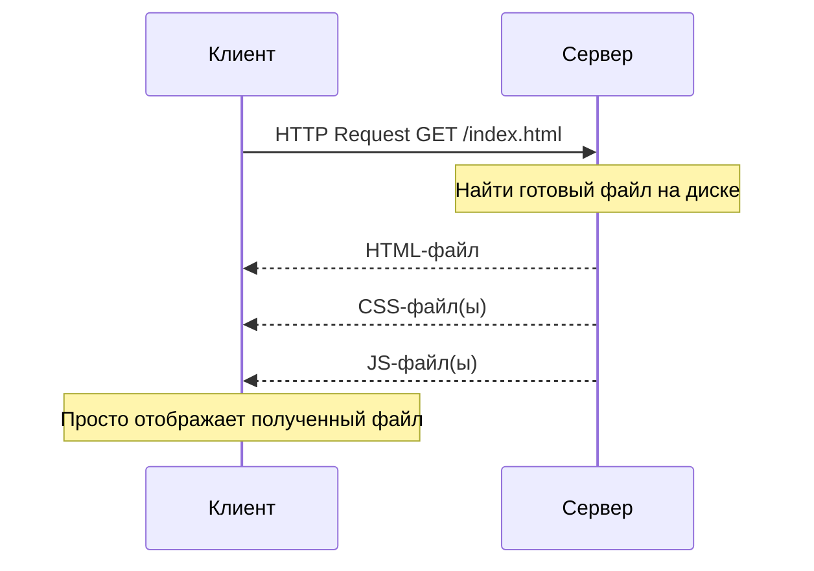
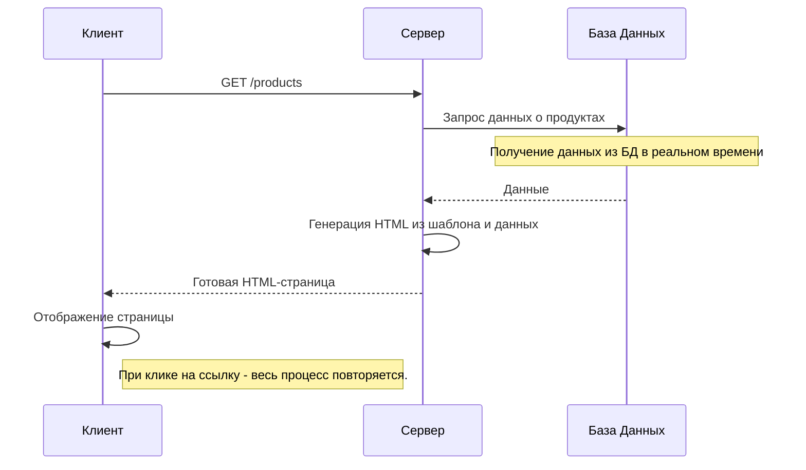
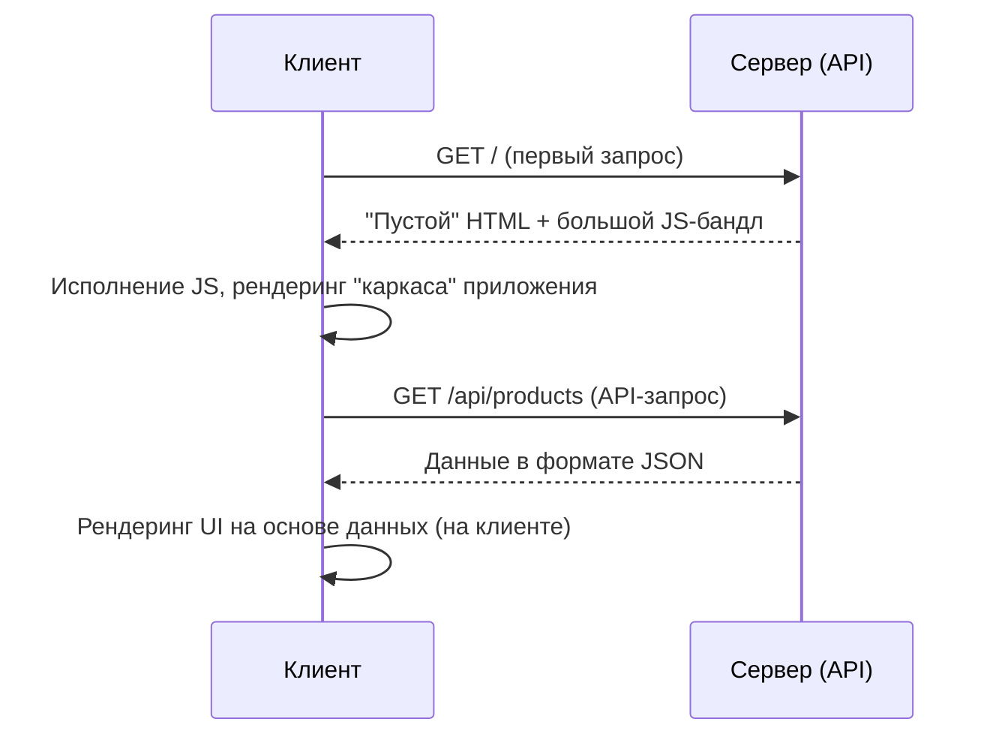
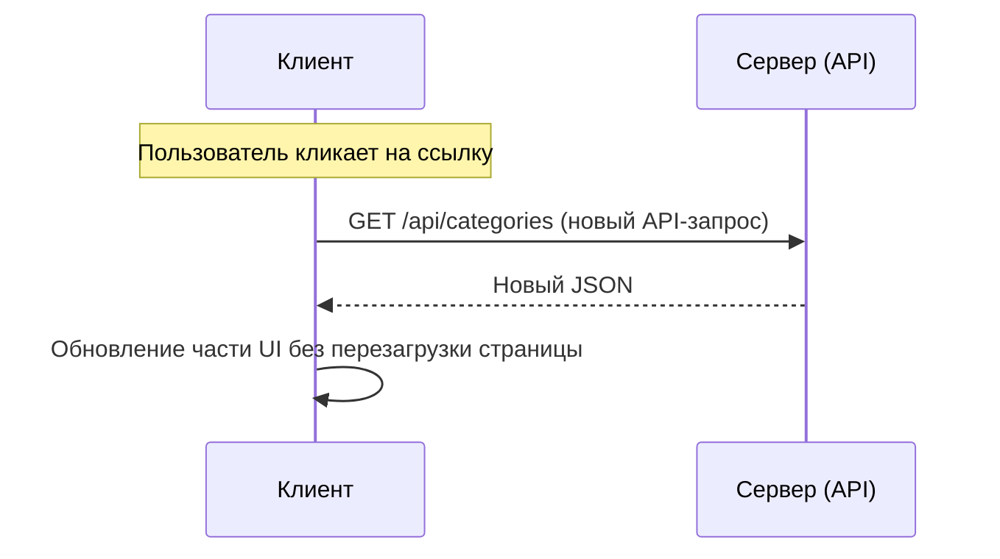
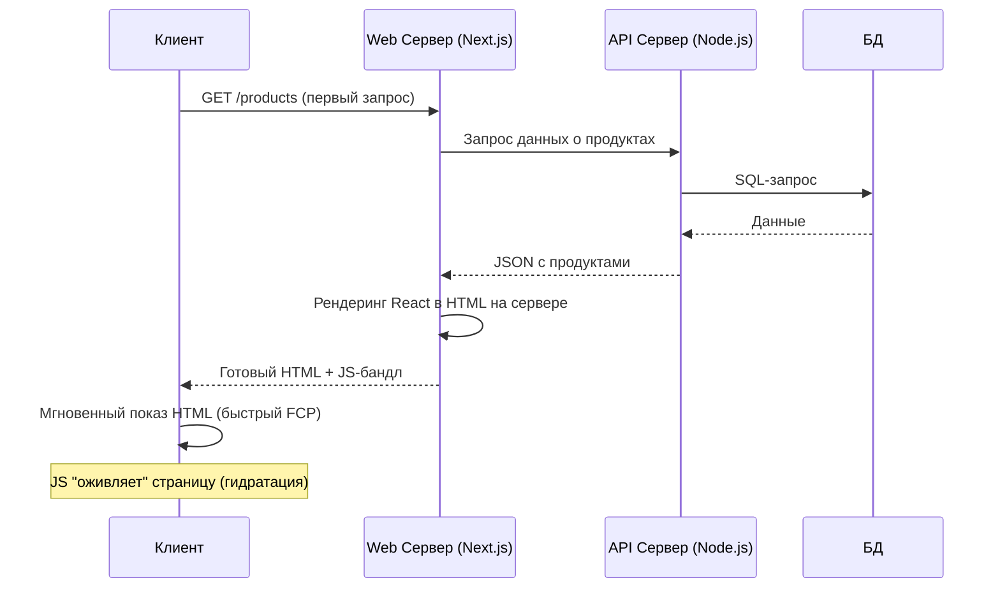
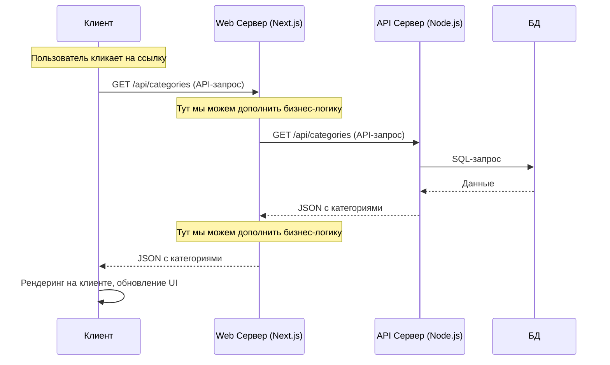

# OTUS

## Javascript Basic

<!-- v -->

### Вопросы?

<!-- s -->

## Подключение дополнительных библиотек в React

<!-- v -->

React — это библиотека для создания UI. Она не решает всех задач "из коробки".

<!-- v -->

Задачи, которые React не решает:

- Маршрутизация (роутинг)
- Продвинутое управление состоянием
- Работа с формами
- Готовые UI-компоненты
- Анимации

Для этого существует огромная экосистема библиотек.

<!-- v -->

Зачем нужны внешние библиотеки?

- Ускоряют разработку
- Предлагают готовые решения (UI, роутинг, форма)
- Делают код чище и понятнее
- Снижают количество багов за счет battle-tested решений

<!-- v -->

Самые популярные направления:

- **Роутинг** (React Router)
- **UI-компоненты** (Material UI, Ant Design, Chakra UI)
- **Управление состоянием** (Redux, Zustand, Recoil)
- **Формы** (Formik, React Hook Form)
- **Графики и визуализация** (Recharts, Victory, D3)

<!-- v -->

Как выбрать библиотеку?

- Популярность: Звезды на GitHub, скачивания в npm.
- Поддержка: Активное сообщество, частые обновления.
- Документация: Понятная, с примерами, актуальная.
- Размер бандла: Насколько библиотека увеличит размер приложения? (bundlephobia.com)
- API: Насколько интуитивно понятен и удобен код?

<!-- v -->

### Вопросы?

<!-- s -->

## Какой web существует

<!-- v -->

Что такое роутинг в SPA?

В Single Page Application (SPA) страница не перезагружается. JavaScript динамически меняет контент. Роутер синхронизирует UI с URL в адресной строке.

<!-- v -->

Эволюция веба: SSG, SSR и SPA

<!-- v -->

#### Статический сайт

Самый первый подход. Сервер просто отдает заранее подготовленные HTML-файлы. Никакой генерации на лету нет.

<!-- v -->



<!-- v -->

Плюсы: Максимальная скорость, безопасность, дешевизна хостинга.

Минусы: Не подходит для динамического контента (профили пользователей, корзины и т.д.).

<!-- v -->

#### Рендеринг на сервере (Classic SSR)

Классический подход (PHP, Ruby on Rails, Python/Django). При каждом запросе сервер "собирает" HTML-страницу из шаблона и данных, а затем отдает ее клиенту.

<!-- v -->



<!-- v -->

Плюсы: Отличное SEO, быстрая первая загрузка.

Минусы: Полная перезагрузка страницы при каждом действии, высокая нагрузка на сервер.

<!-- v -->

#### Одностраничное приложение (SPA - Single-Page App)

Подход, ставший популярным с появлением React, Angular, Vue. Сервер один раз отдает "каркас" приложения и JavaScript-бандл, который затем управляет всем: рендерингом, запросами данных и переходами между страницами без перезагрузки.

<!-- v -->



<!-- v -->



<!-- v -->

Плюсы: Быстрый и плавный интерфейс (как у десктопного приложения), снижение нагрузки на сервер.

Минусы: Проблемы с SEO, долгая первая загрузка (Time to Interactive).

<!-- v -->

#### Современный SSR / SSG (Next.js, Nuxt.js)

Гибридный подход, который объединяет лучшее из миров SSR и SPA. Первая загрузка страницы происходит на сервере (быстро и хорошо для SEO), а последующие переходы работают как в SPA (быстро и плавно).

<!-- v -->



<!-- v -->



<!-- v -->

### Вопросы?

<!-- s -->

## React Router v7

<!-- v -->

#### Установка

```bash
npm install react-router
```

<!-- v -->

#### Подключение роутера

```jsx
import React from "react";
import ReactDOM from "react-dom/client";
import { BrowserRouter } from "react-router";
import App from "./app";

const root = document.getElementById("root");

ReactDOM.createRoot(root).render(
  <BrowserRouter>
    <App />
  </BrowserRouter>
);
```

<!-- v -->

Основные компоненты

- **`<Routes>`** — контейнер для всех возможных маршрутов.
- **`<Route>`** — связывает путь (`path`) с компонентом (`element`).
- **`<Link>`** — замена тега `<a>` для навигации без перезагрузки страницы.

<!-- v -->

```jsx
import { BrowserRouter, Routes, Route, Link } from "react-router";

function Home() {
  return <h2>Главная</h2>;
}
function About() {
  return <h2>О нас</h2>;
}

function App() {
  return (
    <BrowserRouter>
      <nav>
        <Link to="/">Главная</Link> | <Link to="/about">О нас</Link>
      </nav>
      <Routes>
        <Route path="/" element={<Home />} />
        <Route path="/about" element={<About />} />
      </Routes>
    </BrowserRouter>
  );
}
```

<!-- v -->

Динамические роуты и параметры

```jsx
<Route path="/products/:id" element={<Product />} />
```

<!-- v -->

Получаем параметр в компоненте с помощью хука useParams

```jsx
import { useParams } from "react-router-dom";

function PostPage() {
  const { postId } = useParams(); // Например, { postId: '1' }
  return <h1>Просмотр поста с ID: {postId}</h1>;
}
```

<!-- v -->

Вложенные роуты и `<Outlet>`

Часто в приложении есть общий layout (шапка, подвал), а меняется только основная часть.

<!-- v -->

```jsx
import { Outlet, Link } from "react-router-dom";

function Layout() {
  return (
    <div>
      <header>
        {" "}
        {/* Шапка будет на всех страницах */}
        <Link to="/">Главная</Link> | <Link to="/posts">Посты</Link>
      </header>
      <main>
        <Outlet /> {/* Сюда будет подставляться контент страницы */}
      </main>
    </div>
  );
}
```

<!-- v -->

Используем layout в роутах

```jsx
<Routes>
  <Route path="/" element={<Layout />}>
    <Route index element={<HomePage />} />
    <Route path="posts" element={<PostsListPage />} />
    <Route path="posts/:postId" element={<PostPage />} />
  </Route>
</Routes>
```

<!-- v -->

Программная навигация

```jsx
import { useNavigate } from "react-router-dom";

function AddPostForm() {
  const navigate = useNavigate();

  const handleSubmit = (event) => {
    event.preventDefault();
    // ...логика создания поста
    navigate("/posts"); // Перенаправляем на страницу постов
  };

  return <form onSubmit={handleSubmit}>{/* ... */}</form>;
}
```

<!-- v -->

PrivateRoute компонент

```jsx
import { Navigate, Outlet } from "react-router-dom";

const useAuth = () => {
  const user = localStorage.getItem("user");
  return !!user;
};

export function PrivateRoute() {
  const isAuth = useAuth();
  return isAuth ? <Outlet /> : <Navigate to="/login" replace />;
}
```

<!-- v -->

```jsx
<Routes>
  <Route path="/" element={<Home />} />
  <Route path="/about" element={<About />} />

  {/* Публичные роуты */}
  <Route element={<PublicRoute />}>
    <Route path="/login" element={<Login />} />
  </Route>

  {/* Приватные роуты */}
  <Route element={<PrivateRoute />}>
    <Route path="/dashboard" element={<Dashboard />} />
    <Route path="/profile" element={<Profile />} />
  </Route>
</Routes>
```

<!-- v -->

Недоступные для авторизованных:

- /login — страница входа (логично, раз уже вошёл).
- /register — регистрация (новый аккаунт не нужен, если пользователь уже внутри).
- /forgot-password — сброс пароля (активному пользователю обычно не нужен).
- /verify-email — подтверждение e-mail (после подтверждения — редирект).
- /welcome / /onboarding — экраны приветствия или первой настройки.

<!-- v -->

### Вопросы?

<!-- v -->

### Тестирование React Router

<!-- v -->

```jsx
test("редирект на /dashboard если уже авторизован", () => {
  localStorage.setItem("user", "true");

  render(
    <MemoryRouter initialEntries={["/login"]}>
      <Routes>
        <Route element={<PublicRoute />}>
          <Route path="/login" element={<h1>Логин</h1>} />
        </Route>
        <Route path="/dashboard" element={<h1>Кабинет</h1>} />
      </Routes>
    </MemoryRouter>
  );

  expect(screen.getByText("Кабинет")).toBeInTheDocument();
});
```

<!-- v -->

### Вопросы?

<!-- s -->

### UI-компоненты с Material-UI (MUI)

<!-- v -->

Зачем нужны UI-библиотеки?

- Скорость: Не нужно писать CSS для каждой кнопки и инпута.
- Консистентность: Все элементы выглядят в едином стиле.
- Доступность (a11y): Компоненты уже настроены для скрин-ридеров и клавиатуры.
- Темы: Легко менять цветовую схему всего приложения.

<!-- v -->

Популярные библиотеки: Material-UI (MUI), Ant Design, Chakra UI.

<!-- v -->

Установка и использование MUI

```bash
npm install @mui/material @emotion/react @emotion/styled
```

<!-- v -->

Пример использования

```jsx
import Button from "@mui/material/Button";
import Typography from "@mui/material/Typography";
import Box from "@mui/material/Box";

function MyComponent() {
  return (
    <Box sx={{ p: 2, border: "1px solid grey" }}>
      <Typography variant="h5">Карточка товара</Typography>
      <Typography sx={{ mb: 1.5 }} color="text.secondary">
        Описание товара...
      </Typography>
      <Button variant="contained">Добавить в корзину</Button>
    </Box>
  );
}
```

<!-- v -->

Чтобы кнопка MUI работала как ссылка, используем проп component.

```jsx
import { Link as RouterLink } from "react-router-dom";
import Button from "@mui/material/Button";

// ...
<Button component={RouterLink} to="/about">
  О нас
</Button>;
```

<!-- v -->

### Вопросы?

<!-- s -->

[Домашнее задание](https://github.com/JavaScript-Basic-OTUS/otus--jsbasic/blob/master/lessons/lesson33/task.md)

<!-- s -->

### Дополнительные материалы

- [Официальная документация React Router v6](https://reactrouter.com/)
- [Официальная документация Material-UI (MUI)](https://mui.com/material-ui/getting-started/)
- [BundlePhobia - проверка размера библиотек](https://bundlephobia.com/)
