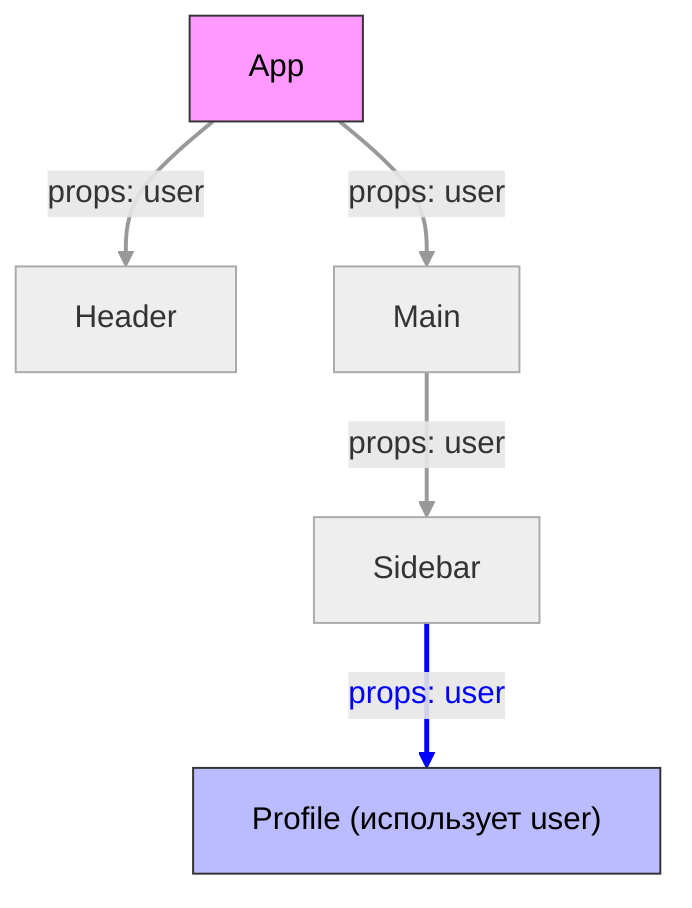
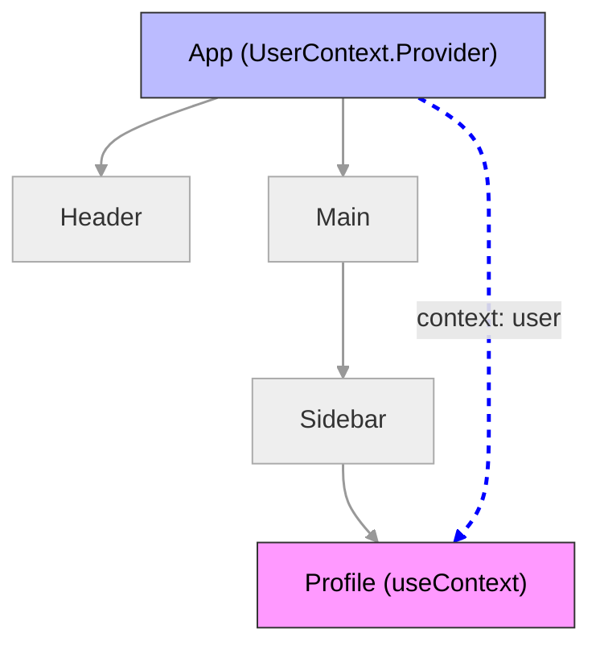
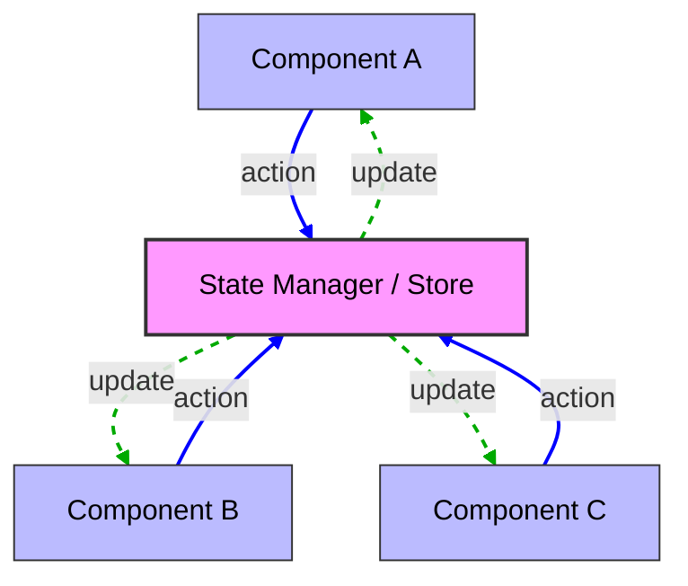

# OTUS

## JavaScript Basic

<!-- v -->

### Вопросы?

<!-- s -->

### Разделение состояния между компонентами

### подъем состояния

### useContext

### State managers

<!-- v -->

### Проблема

как разделить состояние между компонентами?

<!-- v -->

React-компоненты часто должны **делиться данными** между собой.

<!-- v -->

Пример: у нас есть компонент формы и компонент отображения результата.

```jsx
function InputForm({ onSubmit }) {
  const [value, setValue] = useState("");
  return (
    <form
      onSubmit={(e) => {
        e.preventDefault();
        onSubmit(value);
      }}
    >
      <input value={value} onChange={(e) => setValue(e.target.value)} />
      <button>Отправить</button>
    </form>
  );
}

function Result({ text }) {
  return <h2>Результат: {text}</h2>;
}
```

<!-- v -->

Если оба компонента независимы — где хранить общее состояние?

<!-- v -->

Подъем состояния (Lifting State Up)

Это первый способ "поделиться" данными: перенести состояние выше по иерархии.

<!-- v -->

```jsx
function App() {
  const [text, setText] = useState("");

  return (
    <div>
      <InputForm onSubmit={setText} />
      <Result text={text} />
    </div>
  );
}
```

<!-- v -->

Плюсы:

- Просто и понятно
- Отлично подходит для небольших приложений
- Без сторонних зависимостей

<!-- v -->

Минусы:

- Чем больше компонентов, тем сложнее передавать пропсы вниз
- "Пробрасывание пропсов" (props drilling)

<!-- v -->

Props Drilling

```jsx
<App>
  <Header user={user} />
  <Main user={user}>
    <Sidebar user={user} />
  </Main>
</App>
```

<!-- v -->

Props Drilling



<!-- v -->

Приходится передавать **user** через все уровни, даже если промежуточным он не нужен.

<!-- v -->

Решение:

Контекст (Context API)

<!-- v -->

React Context позволяет избежать props drilling и делиться состоянием напрямую между компонентами.

<!-- v -->

```jsx
const UserContext = createContext();

function App() {
  const [user, setUser] = useState({ name: "Andrey" });

  return (
    <UserContext.Provider value={user}>
      <Header />
      <Main />
    </UserContext.Provider>
  );
}

function Header() {
  const user = useContext(UserContext);
  return <h1>Привет, {user.name}!</h1>;
}
```

<!-- v -->

Визуализация Context API



<!-- v -->

Плюсы:

- Удобно для "глобальных" данных (тема, язык, текущий пользователь)
- Нет необходимости передавать пропсы вручную

<!-- v -->

Минусы:

- Контексты плохо подходят для часто изменяющегося состояния
- Труднее тестировать и дебажить
- Перерисовываются все потребители при изменении контекста

<!-- v -->

Когда использовать Context

- Данные нужны многим компонентам на разных уровнях
- Эти данные редко меняются (напр. настройки, тема)
- Вы хотите избежать пропс-дриллинга

<!-- v -->

Контексты можно комбинировать

```jsx
<ThemeContext.Provider value="dark">
  <UserContext.Provider value={user}>
    <App />
  </UserContext.Provider>
</ThemeContext.Provider>
```

И читать их отдельно

```jsx
const theme = useContext(ThemeContext);
const user = useContext(UserContext);
```

<!-- v -->

### Вопросы?

<!-- s -->

### Менеджеры состояния (State Managers)

<!-- v -->

Когда нужен State Manager?

<!-- v -->

В небольших приложениях достаточно:

- Подъёма состояния (Lifting State Up)
- Context API для глобальных, редко меняющихся данных

<!-- v -->

Когда приложение растёт, context и поднятие состояния перестают справляться.

<!-- v -->

Типичные проблемы:

- Много компонентов используют одни и те же данные
- Пропсы приходится передавать через несколько уровней
- Контексты становятся сложными и их трудно отлаживать
- Частые перерисовки компонентов → падение производительности

<!-- v -->

Здесь появляются менеджеры состояния (state management libraries):

- Redux
- Zustand
- Recoil
- Jotai
- MobX

<!-- v -->

State Manager (Redux, Zustand, Recoil) — это:

- Центральный источник данных (Store)
- Компоненты подписаны на изменения
- Данные меняются через события / actions
- Уведомления через event bus, а не пропсы

<!-- v -->

Идея: **разделение состояния и UI**, чтобы компоненты не зависели друг от друга напрямую.

<!-- v -->



<!-- v -->

Зачем нужны менеджеры состояния?

- Централизуют все данные приложения
- Обеспечивают предсказуемость
- Позволяют легко обновлять и отслеживать изменения
- Улучшают производительность

<!-- s -->

### Redux Toolkit

<!-- v -->

Когда стоит переходить на Redux Toolkit?

<!-- v -->

Context API отлично подходит для небольших и средних приложений,  
но при росте сложности появляются проблемы:

- Слишком много контекстов
- Перерисовки при изменении состояния
- Неудобно отслеживать логику обновления
- Трудно дебажить

<!-- v -->

Что такое Redux Toolkit?

<!-- v -->

Redux Toolkit (RTK) — официальный, **рекомендуемый способ** работы с Redux.

Он решает старые проблемы Redux:

- Меньше шаблонного кода
- Простая настройка
- Интеграция с TypeScript и React
- Поддержка `immer` (иммутабельность под капотом)

<!-- v -->

Установка

```bash
npm install @reduxjs/toolkit react-redux
```

<!-- v -->

Базовая структура

```
src/
 ├─ app/
 │   └─ store.js
 ├─ features/
 │   └─ counter/
 │       ├─ counterSlice.js
 │       └─ Counter.jsx
 └─ App.jsx
```

<!-- v -->

Пояснение:

- **Store** — где хранится всё состояние
- **Slice** — часть состояния + actions
- **Компонент** — подписывается на данные и диспатчит actions

<!-- v -->

```jsx
import { createSlice } from "@reduxjs/toolkit";

const counterSlice = createSlice({
  name: "counter",
  initialState: { value: 0 },
  reducers: {
    increment: (state) => {
      state.value += 1;
    },
    decrement: (state) => {
      state.value -= 1;
    },
    reset: (state) => {
      state.value = 0;
    },
  },
});

export const { increment, decrement, reset } = counterSlice.actions;
export default counterSlice.reducer;
```

<!-- v -->

Настройка store

```jsx
import { configureStore } from "@reduxjs/toolkit";
import counterReducer from "../features/counter/counterSlice";

export const store = configureStore({
  reducer: {
    counter: counterReducer,
  },
});
```

<!-- v -->

Подключение к React

```jsx
import React from "react";
import ReactDOM from "react-dom/client";
import { Provider } from "react-redux";
import { store } from "./app/store";
import App from "./App";

ReactDOM.createRoot(document.getElementById("root")).render(
  <Provider store={store}>
    <App />
  </Provider>
);
```

<!-- v -->

Использование в компоненте

```jsx
import { useSelector, useDispatch } from "react-redux";
import { increment, decrement, reset } from "./counterSlice";

export function Counter() {
  const value = useSelector((state) => state.counter.value);
  const dispatch = useDispatch();

  return (
    <div>
      <h2>Счётчик: {value}</h2>
      <button onClick={() => dispatch(increment())}>+</button>
      <button onClick={() => dispatch(decrement())}>-</button>
      <button onClick={() => dispatch(reset())}>Сброс</button>
    </div>
  );
}
```

<!-- v -->

Преимущества Redux Toolkit

- Минимум шаблонного кода
- Простая типизация
- Отличная интеграция с DevTools
- Легко масштабируется
- Подходит для крупных приложений

<!-- v -->

Когда выбирать Redux Toolkit

- Когда приложение растёт
- Когда нужно предсказуемое состояние
- Когда важен контроль и отладка
- Когда Context API становится неудобным

<!-- v -->

### Вопросы?

<!-- v -->

### Что важно запомнить

- Всё — **состояние**, вопрос лишь _где оно живёт_
- **Начинай просто** — поднимай состояние, используй контекст
- Когда становится сложно — переходи к **Redux Toolkit**
- Redux теперь не "монстр", а удобный инструмент с RTK

<!-- v -->

### Итого

- React даёт гибкость, но ответственность за архитектуру на вас
- Управление состоянием — ключевой навык фронтенд-разработчика
- Redux Toolkit — современный, простой и безопасный способ масштабировать приложение
- Важно понимать не только "как", но и "зачем"

<!-- s -->

### Дополнительные материалы

1. [Написание тестов для связки React + Redux](https://redux.js.org/usage/writing-tests#connected-components)
1. [Мини-курс по Redux от Дэна Абрамова](https://egghead.io/)
1. [Продвинутое продолжение курса (по связке React + Redux)](https://egghead.io/courses/building-react-applications-with-idiomatic-redux)
1. [React HoC в TypeScript. Типизация без боли](https://habr.com/ru/company/sberbank/blog/354104/)
1. [React TypeScript Cheat sheet: Full HOC Example](https://react-typescript-cheatsheet.netlify.app/docs/hoc/full_example)
